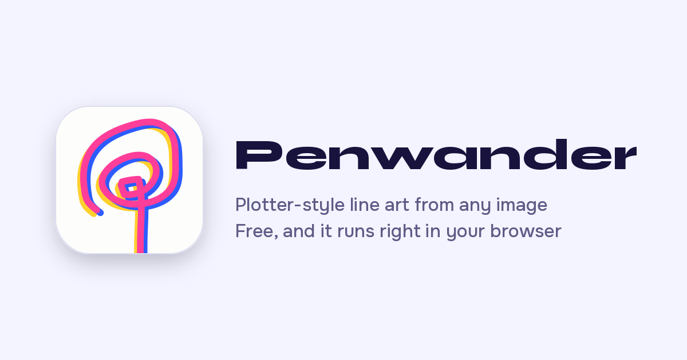

# Penwander

Turn any image into a plotter-style line drawing, or trace it by hand.

**Live site:** https://penwander.github.io/

## What it does

- **Generate:** traces an image as one continuous line or as separate strokes, the way a pen plotter would draw it. Presets, tone controls (brightness, contrast, gamma, edge emphasis), line controls (length, definition, smoothing, wobble, seed) and a three-pen cyan/magenta/yellow mode.
- **Trace & draw:** a blank sheet with your image as a faint guide. Draw with a pen, paint with a line brush that uses the same algorithm, erase, undo and redo.
- **Real paper sizes:** A4, A3, Letter and custom widths in millimetres, with pen tip sizes in mm and an estimated plot time.
- **Export:** PNG (up to 4800 px), SVG sized in millimetres with one path per pen (ready for a plotter), and TXT coordinates in mm.

Everything runs in the browser. Images are never uploaded anywhere.

## Files

| File | Purpose |
|---|---|
| `index.html` | The whole app: markup, styles and script in one file |
| `favicon.svg` | Browser-tab icon |
| `apple-touch-icon.png`, `icon-512.png` | Home-screen icons |
| `og-image.png` | Preview image shown when the link is shared |

No build step. Edit `index.html` and commit; GitHub Pages redeploys automatically.

## Credits

Inspired by [PINTR](https://javier.xyz/pintr) by javierbyte.
